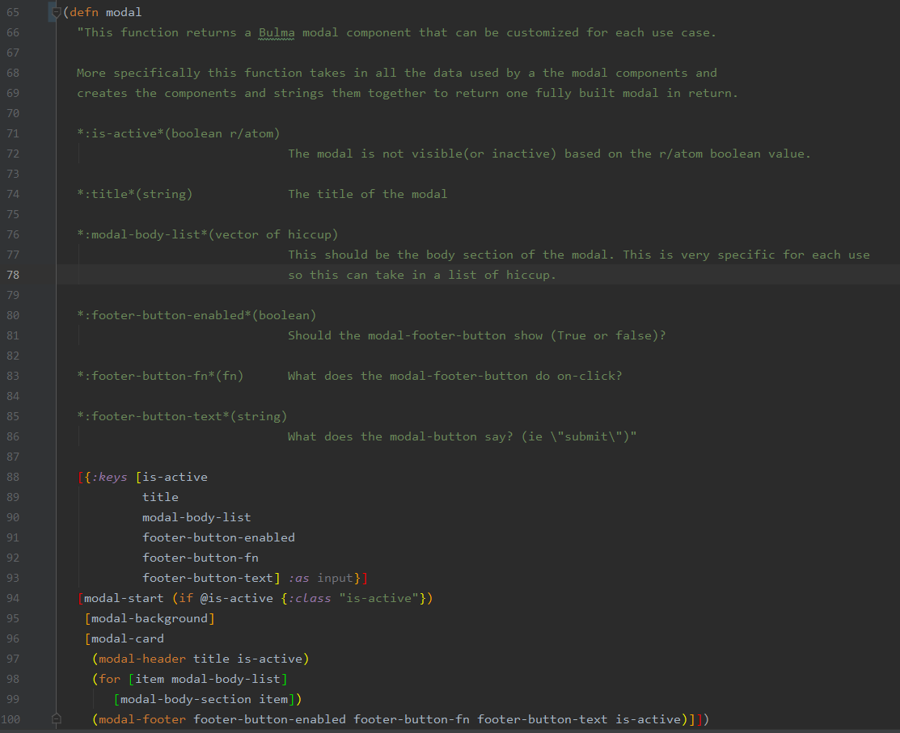

## Modal

The modal usage is to be contained within the 
[vanilla.modal](../src/cljs/vanilla/modal.cljs) namespace.

The modal namespace uses the Bulma.io modal, found 
[here](https://bulma.io/documentation/components/modal/).

### The Purpose

The point of having a modal namespace is to consolidate the codebase that uses
modal components and make it easier to use the modal hiccup without the risk
of typos and various errors. Ultimately we want all modals to be called 
through this code so in case we adopt new versions of modal hiccups or 
plugins we can change one namespace instead of several.

#### Todo

- Configure Widget does not run through modal code 

## The Code

In the [modal](../src/cljs/vanilla/modal.cljs) namespace there are three sections to pay attention to.

#### Helper functions

These definitions are considered helper definitions since they don't have
logic within them. These are used to keep a reference to working hiccup
that we use for parts of the modal. 

#### Modal Components

This is where the modal components are constructed, including the header,
body and footer. All of these parts are called through the above functions
and kept separate to make it more module. These functions can be called 
by themselves within a code base in addendum to some helper functions
to make a modal.

#### Modal Main

This is considered the "main" use of the modal class, an all-encompassing 
function that you pass information to and it builds the modal with all
the standard functionality. This is made to take in any number of modal
"body" components for scalability and flexibility about what data is shown.

It's important to note that although this takes in 6 arguments to call
this function, it mainly takes these arguments and passes them to 
the components and helper functions that are in this namespace. This means
the modal can be used outside of this function just using those pieces,
but this single function call makes a single compact and tested modal.