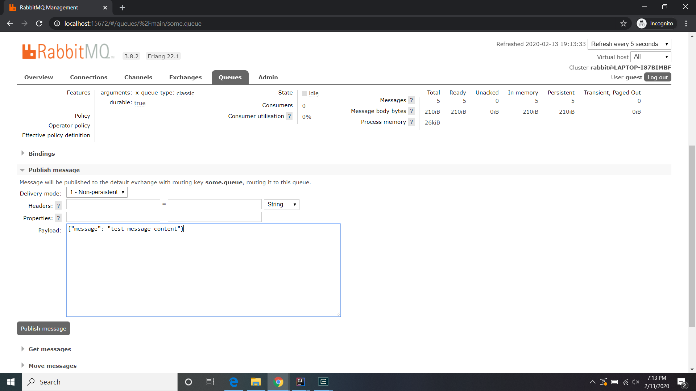

# RabbitMQ Configuration

In general, prior to running the app, you will need to install (not discussed here) _and_ run RabbitMQ. Then, using  
the management console at:

    localhost:15672

You need to set up a vhost called `/main` and add the following exchange to that vhost:

1. `my-exchange`

Then add the following queues and binding:

1. `some.queue` bound to `my-exchange`

## Working with the RabbitMQ Console

You can access the RabbitMQ Web-console by opening your browser to

    localhost:15672

### Logging In

Use any admin credentials you may have created, but for our purposes, we will use the default "guest/guest" id/password
combination. We are doing local development so this is acceptable.

_fig. 1 Login Screen_

### Console Tabs

_fig. 2 The Main Console Dashboard_

_fig. 3 The "Queues" Dashboard_

You can examine the message on a given queue by accessing that queues page. Click on the queue name  
in the list shown in _fig. 1_

_fig. 4 The "some.queue" Dashboard_

### Publishing Messages

To publish a message onto the current queue, click on the `> Publish message` item and the tool will unfold. Specify the content of the message to publosh
and click the `Publish Message` button:

_fig. 5 Publishing messages using the "Queues" Dashboard_

> Note: Message content must be in valid JSON format. For example:
>
> `{"message": "content"}`
>
> In JSON, map keys are strings and the ':' is _after_ the key name string.