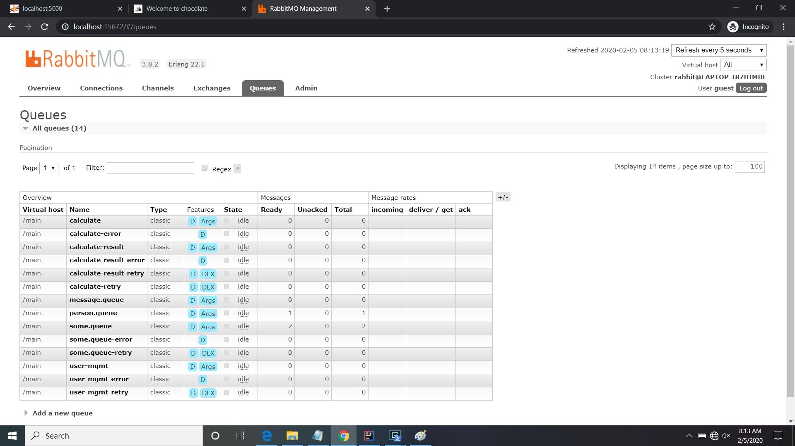

# RabbitMQ Configuration

Prior to running the app, you will need to install (not discussed here) _and_ run RabbitMQ. Then, using  
the management console at

    localhost:15672

You need to set up a vhost called `/main` and add the following exchanges to that vhost:

1. `my-exchange`

Then add the following queues and bindings:

1. `some.queue` bound to `my-exchange`

## Working with the RabbitMQ Console

You can access the RabbitMQ Web-console by opening your browser to

    localhost:15672

### Logging In

Use any admin credentials you may have created, but for our purposes, we wil use the default "guest/guest" id/password
combination. We are doing local development so this is acceptable.

_fig. 1 Login Screen_

## Console Tabs

_fig. 2 The Main Console Dashboard_

_fig. 3 The "Queues" Dashboard_

You can examine the message on a given queue by accessing that queues page. Click on the queue name  
in the list shown in _fig. 1_

_fig. 3 The "some.queue" Dashboard_

Then click on the `> Get messages` item and the tool will unfold. Specify the number of messages to retrieve
and click the `Get Message(s)` button:

_fig. 3 The "Queues" Dashboard_

If you want to actually remove the messages from the queue when you "get" them, just set the `Ack Mode` pull-down
to `Ack message requeue false` and the retrieved messages will be removed from the queue.
